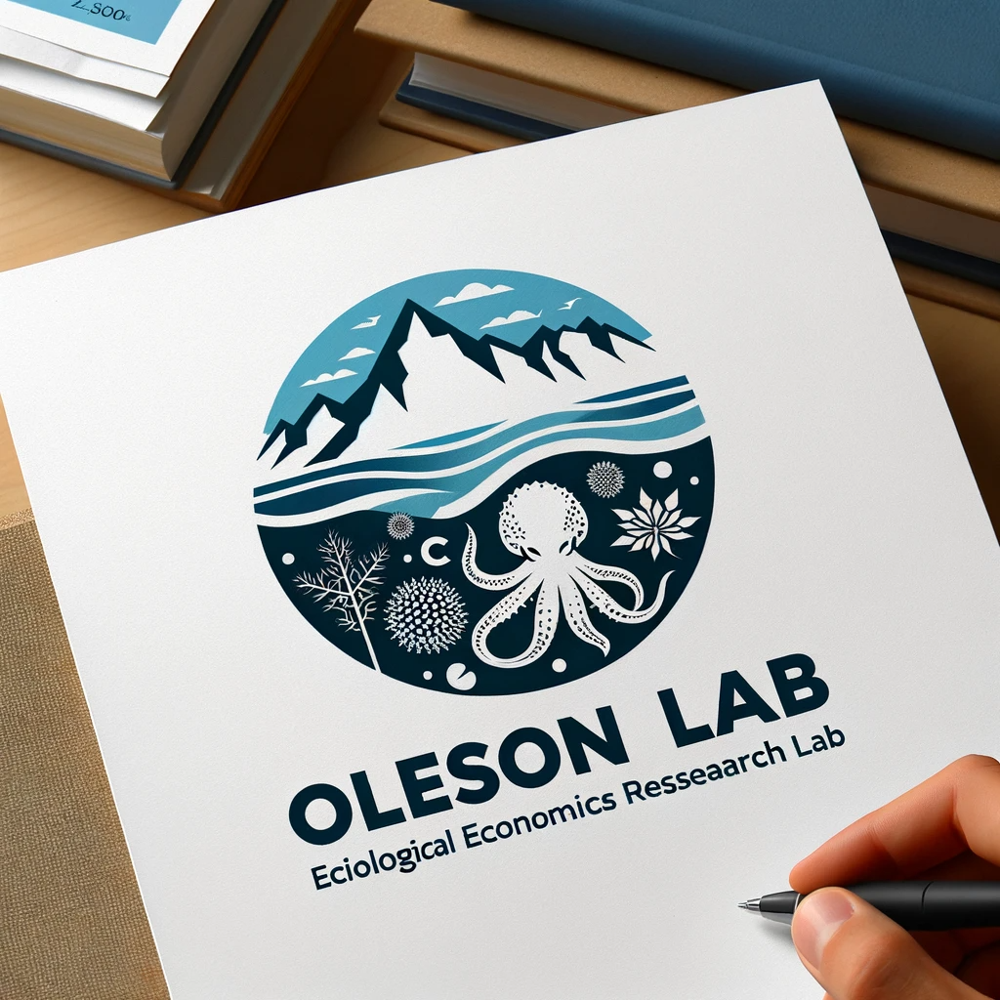

<!-- {width=32% fig-align="center" .rounded} -->

<h1 class='title' id='custom-title'>
Welcome! E komo mai!
</h1>

Thank you for visiting the site of the Oleson Ecological Economics lab within the   [Department of Natural Resources and Environmental Management](http://www.ctahr.hawaii.edu/nrem/) at the University of Hawaiʻi at Mānoa.

We are a diverse and interdisciplinary group interested in developing management-relevant analyses and tools.
We focus on natural resource and environmental management problems spanning the mountain top to the coral reef.
We employ a multitude of approaches, from quantification and valuation of ecosystem goods and services, data-driven and participatory modeling, value chain analysis, alternative economic welfare indicators, policy analysis, and decision science.
