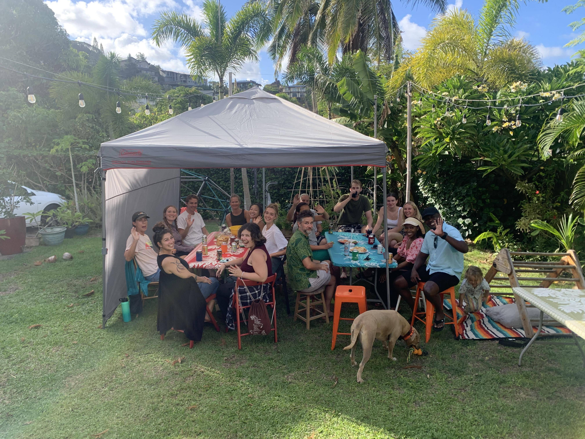
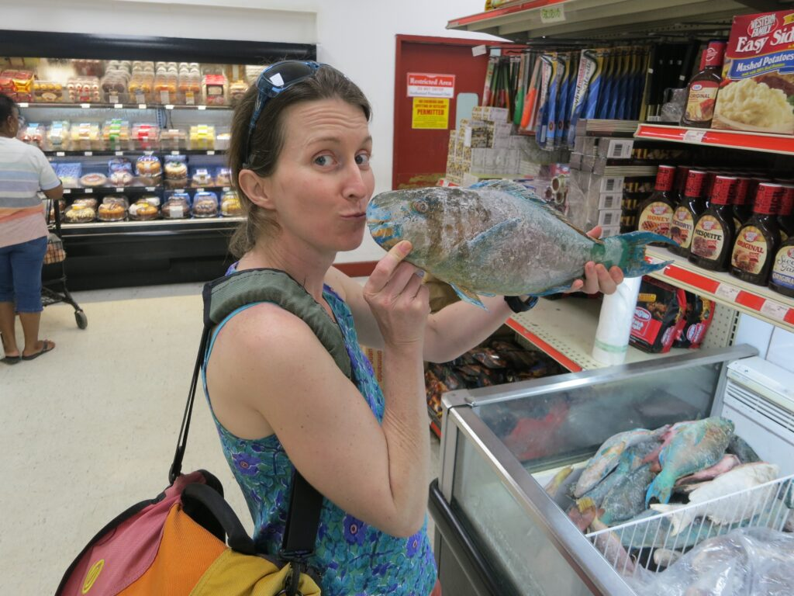
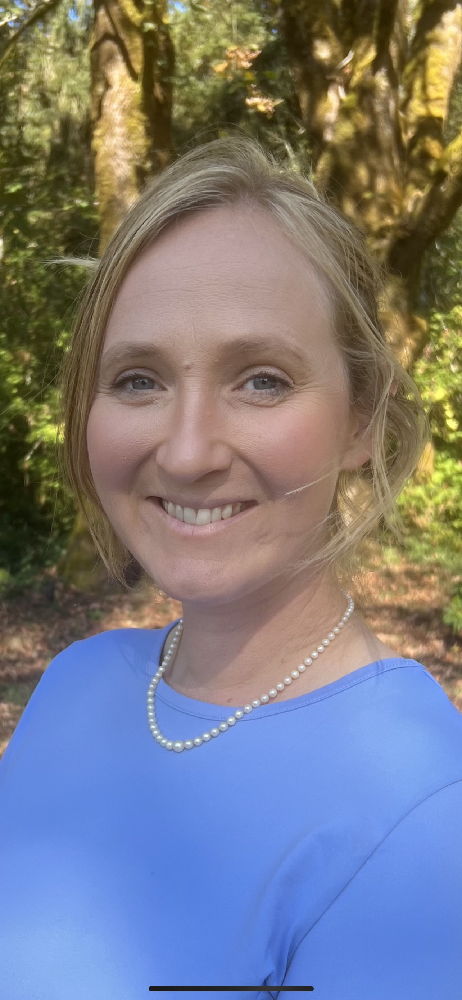
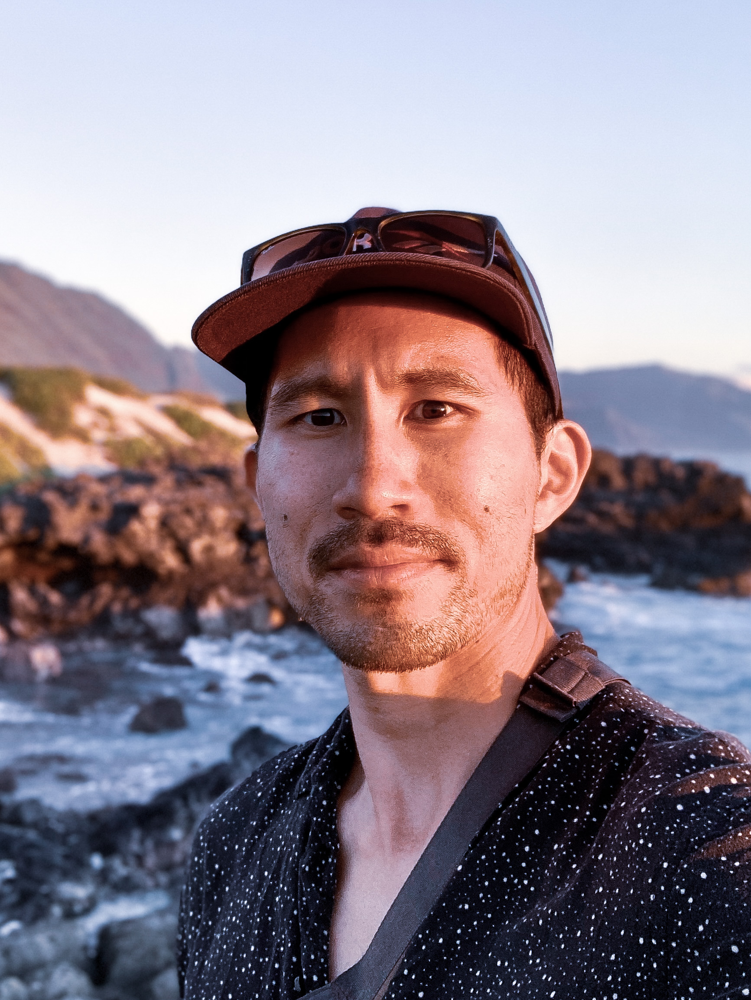
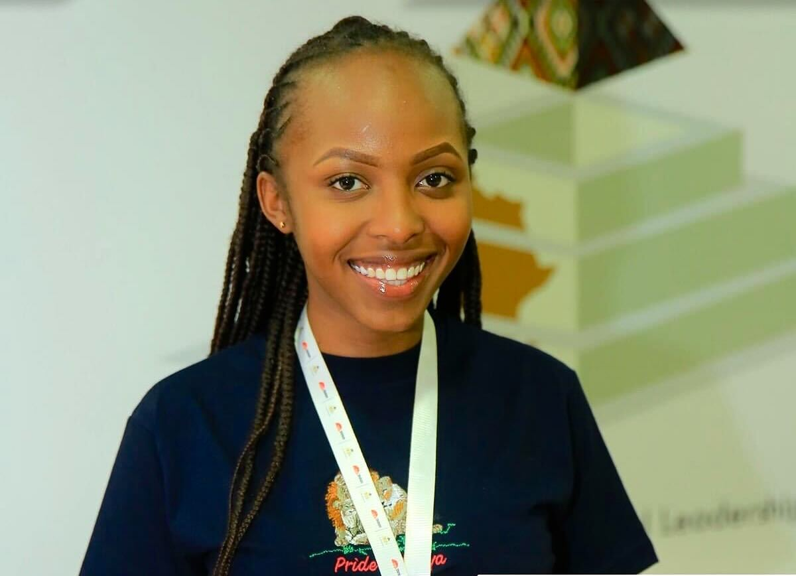
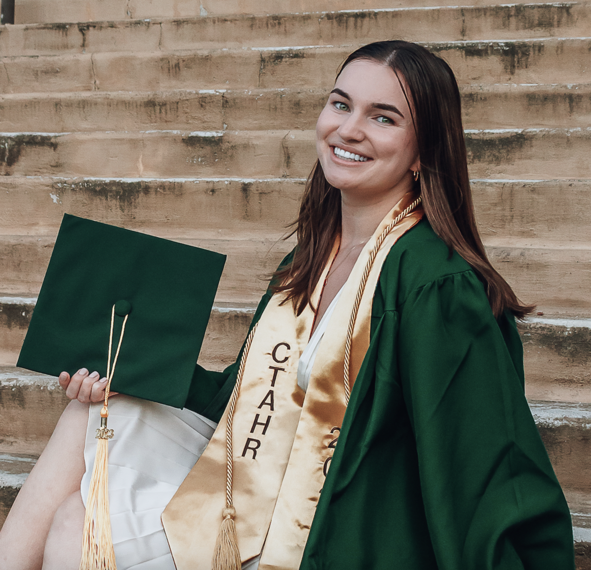

{.rounded fig-align="center"}

## Principal Investigator

### Kirsten L.L. Oleson  

:::: {.columns}
::: {.column width="40%"}

                      

{.rounded width="250"}

[](https://orcid.org/0000-0002-7992-5051) 
[](https://scholar.google.com/citations?user=4pP2V9wAAAAJ&hl=en&oi=ao) 
[](https://www.researchgate.net/profile/Kirsten_Oleson)

:::

::: {.column width="60%"}

I am an ecological economist.
This "discipline" is actually an amalgam of many disciplines and schools of thought: economics, ethics, sociology, and environmental science, among many others.
I use the power of economics to help address environmental policy problems.
But, I recognize that economics is rife with implicit ethical assumptions and implications, such as whose values count and how much.
Further, an economic worldview oftentimes doesn't adequately capture knowledge from environmental science or indigenous worldviews.

I became interested in environmental policy, and the role of economics in decision-making, working as an impact assessment specialist at the World Bank.
Between 1998 and 2003, I specialized in quantifying environmental and social impacts of development projects, and ensuring these impacts were then adequately addressed in management plans.
Many times "economic" considerations trumped "environmental and social" concerns.
I put these all in quotes, because "environmental and social" would be incorporated in "economic" if we had the right valuation tools.
I grew frustrated with the schism between what I know was valuable and what we could value in economic analysis.
And therein lies the motivation for my research program...

My dissertation focused on national sustainability accounts.
These accounts are a better reflection of national wealth and growth than traditional economic measures, such as GDP.
I had the honor to work with a superstar team, including Kenneth Arrow (Nobel Laureate), Sir Partha Dasgupta, Lawrence Goulder, and Kevin Mumford, to further improve an economic sustainability indicator originally developed by Kirk Hamilton and his team at the World Bank.
My ongoing research in this area aims to better measure and incorporate nature's goods and services.

After completing my dissertation in 2007, I was a Teaching Fellow with Stanford University's new Public Policy Program.
I co-directed the policy analysis capstone class (with Mary Sprague), led a seminar on applying competing conceptions of justice to public policy (with Josh Cohen), and co-taught a course on collective action (with Debra Satz).
I founded an environmental ethics working group, and led a Humanities Center workshop on environmental norms, institutions, and policy.

In 2010, I embarked on an NSF-funded post-doc to Madagascar.
There, I studied the impacts of fisheries management, the economic value of coastal ecosystem services, conditions conducive to community management, and climate change adaptation, among others.

In January of 2012 I started with the [University of Hawaii -- Department of Natural Resources and Environmental Management](https://www.ctahr.hawaii.edu/nrem/).
My research focuses on improving natural resource and environmental management by integrating methods, approaches, and tools from economics, geography, natural science, decision science, and political science.
In 2021, I was awarded a [Pew Marine Conservation Fellowship to build coastal ecosystem accounts for Hawaiʻi](https://www.pewtrusts.org/en/projects/marine-fellows/fellows-directory/2021/kirsten-ll-oleson).

:::

::::

## Current Lab Members

### Post-Doctoral Fellows

#### Anders Dugstad

#### Ashley Lowe MacKenzie  

:::: {.columns}
::: {.column width="40%"}

{.rounded height="240"}

[](https://scholar.google.com/citations?user=0PteQJcAAAAJ&hl=en) 
[](https://www.researchgate.net/profile/Ashley_Lowe_Mackenzie)

:::

::: {.column width="60%"}

Ashley is an applied environmental economist specializing in the intersection of social and ecological systems, particularly in public lands and outdoor recreation.
She received a PhD in Applied Economics from Oregon State University and joined the lab in June of 2023.

Her research addresses emerging questions in outdoor recreation and public land management, including driving factors for demand, management strategies and various quantitative nonmarket valuation methods.
Ashley's current lab project is focusing on valuing the impacts of ocean acidification on coral reefs through ecosystem provision of recreation and tourism.

:::

::::

### PhD Students

#### Alohi Nakachi

#### Elanur Ural  

:::: {.columns}
::: {.column width="40%"}

{.rounded width="250"}

[]() 
[]() 
[]()

:::

::: {.column width="60%"}

   

Ela is a PhD student out of the Department of Economics at University of Hawai’i at Mānoa. Her research primarily focuses on agriculture and natural resources, with particular interest in the role of social institutions. She works under the Oleson Lab's coastal ecosystem accounting team on the valuation of fisheries for the main Hawaiian islands.

:::

::::

#### Lansing Perng

#### Louis Chua  

:::: {.columns}
::: {.column width="40%"}

{.rounded height="250"}

[]() 
[]() 
[]()

:::

::: {.column width="60%"}

  

Louis is a PhD Candidate in the Department of Natural Resources and Environmental Management (NREM) at University of Hawai’i at Mānoa. He is currently working on Natural Capital Accounting (NCA) and ecosystem valuation projects across the Main Hawaiian Islands.

:::

::::

### Master's of Science Students

#### Ann Nyambega  

:::: {.columns}
::: {.column width="40%"}

{.rounded width="250"}

[]() 
[]() 
[]()

:::

::: {.column width="60%"}

Ann, an MS student, specializes in employing Theory of Change methodology for conducting localized monitoring and evaluation of Ecosystem-based Adaptation projects in Hawaii. Holding a bachelor’s degree in Environmental Planning and Management, she brings a wealth of experience in facilitating the implementation of climate adaptation projects in the Kenyan context. Ann’s research underscores her commitment to advancing and enhancing sustainable localized solutions and enhancing resilience within the socio-ecological landscape.

:::

::::

### Master's of Environmental Management Students

#### Kayla Hodges

### Undergraduate Students

### Research Assistants

#### Alemarie Ceria  

:::: {.columns}
::: {.column width="40%"}

{.rounded width="250"}

[](https://orcid.org/0000-0002-3039-7323) 
[](https://www.linkedin.com/in/alemarieceria/) 
[](https://github.com/alemarieceria)

:::

::: {.column width="60%"}

Alemarie Ceria, a Research Data Analyst, holds a B.A. in Economics from the University of Hawaii at Manoa. Nearing her third year in the lab, she is actively engaged in the Hawaii Coastal Ecosystem Accounting (CEA), the California Innovations at the Nexus of Food, Energy, and Water Systems (INFEWS), and Ocean Acidification (OA) projects. Her responsibilities encompass comprehensive data management, collection, and analysis.
Additionally, she focuses on developing visualizations for reports, presentations, and papers while reinforcing the reproducibility of research across the lab's diverse projects. She co-authored "[Detecting Religion from Space: Nyepi Day in Bali](https://www.sciencedirect.com/science/article/abs/pii/S2352938521001440?via%3Dihub)," published in *Remote Sensing Applications: Society and Environment* on September 6, 2021.

:::

::::

#### Kate Crowell  

:::: {.columns}
::: {.column width="40%"}

{.rounded width="250"}

[]() 
[]() 
[]()

:::

::: {.column width="60%"}

Kate is a research assistant in the Oleson Ecological Economics Lab, working on starting a Donut Economics Action Lab, in addition to continuing collaborative research on the Genuine Progress Indicator with the state. She joined the lab in Spring 2021, where she started as an undergraduate research assistant. Kate recently graduated from the University of Hawaiʻi at Mānoa with a B.S. in Natural Resources and Environmental Management (NREM) and B.A. in Political Science, and is expanding on her previous research in the lab post-grad.

:::

::::

#### Whitney Goodell

## Alumni

### Post-doctoral Fellows

#### Leah Bremer (2012)

Leah helped conduct a needs assessment related to ecosystem services quantification for the state.
Leah is now an Associate Specialist at the University of Hawaiʻi Economic Research Organization.

#### Carlo Fezzi (2017-2019)

Carlo strengthened the non-market valuation capacity of the lab.
Carlo is now a professor in Italy.

#### Megan Barnes (2017-2019)

Megan brought her decision analysis expertise to the lab.
She now works for the government of West Australia.

### PhD Students

#### Hla Htun (2018)

Hla integrated physical science models (watershed), social science models, and participatory system models to evaluate ecosystem services.
Hla was hired by an engineering consulting firm in Honolulu.

#### Jutha Supholdhavanij (2022)

Jutha was a Royal Thai scholar who investigated conflict resolution in Thai marine protected areas.

### Master's of Science Students

#### Shanna Grafeld (2015)

Shanna focused on economic analyses coupled with the Atlantis Ecosystem Model.
She is now a corporate responsibility analyst for a private sector firm in Florida.

#### Becky Ingram (2016)

Becky's thesis used the Driver-Pressure-State-Impact framework as part of NOAA's West Hawai'i Integrated Ecosystem Assessment.
She continues to work as an environmental social scientist with NOAA.

#### Joey Lecky (2016)

Joey's Masters thesis focused on producing maps of cumulative human impact on the marine environment of Hawai'i.
Joey currently works as a geographic information systems (GIS) specialist for NOAA's Integrated Ecosystem Assessment.

#### Mia Iwane (2019)

Mia studied the socioeconomic dynamics of fisheries and fisheries management.
She currently works with the human dimensions program with NOAA PIFSC.

#### Anita Tsang (2021)

Anita, co-advised by Kuʻulei Rodgers, examined the association of octocorals with land-based pollution.
She now works at the Division of Aquatic Resources.

#### Rachael Cleveland (2022)

Rachael focused on applying principles from Structured Decision Making to community-scale fire management in Hawai'i.

### Master's of Environmental Management Students

#### Marcus Peng (2014)

Marcus' capstone focused on the Genuine Progress Indicator for the state.
Marcus continues to work on environmental economic issues in the state.

#### Nanea Lindsey (2015)

Nanea conducted a capstone with the Pacific Island Fish and Wildlife Office related to public education.
She graduated into a job as a Biologist with the U.S.
Fish and Wildlife Service.

#### Casey Ching (2018)

Casey's project identified, mapped, and modeled the cultural dimensions of stream flow within Heʻeia.
Casey's career post-graduation has brought her to the state Division of Forestry and Wildlife, the Division of Aquatic Resources, and she is now the coastal training program coordinator at Heʻeia National Estuarine Research Reserve.

#### Aviv Suan (2019)

Aviv focused on gleaning insights from analyzing public comments from small boat fishers using conflict theory.
He now works as a data analyst at the Hawaiʻi Institute of Marine Biology in the Madin lab.

#### Katia Chikasuye (2019)

Katia was a Hauʻoli Mau Loa fellow working with the Oleson lab and Nelson lab (Oceanography) on water quality and coral reef state.
Kate went on to be a Grau Fellow with the University of Hawaiʻi Sea Grant College Program.

#### Courtney Payne (2019)

Courtney helped create programs for invasive algae removal and monitoring in Paiko Lagoon State Wildlife Sanctuary for Division of Forestry and Wildlife.
She got a job post-graduation with Kahoʻolawe Island Restoration Council as a coastal specialist.

### Undergraduate Students

#### Lukanicole Zavas (2017)

Luka conducted independent research with the Oleson lab on the state's Genuine Progress Indicator, winning a university-wide award.
After graduation, she got a job in restoration in Waimea Valley, Oʻahu, and continued as a graduate student in NREM in the wildlife ecology lab.

### Research Assistants

#### Michele Barnes (2015)

Michele worked as an RA in the Oleson lab analyzing data from Madagascar's small scale fisheries.
She earned her PhD in NREM studying social networks.
Michele is now Senior Research Fellow at ARC Centre of Excellence for Coral Reef Studies, James Cook University.

#### Kim Falinski (2016)

Kim was an RA in the Oleson lab investigating how land-based erosion processes are connected to inputs of sediments and sediment-bound nutrients in the coastal environment.
Kim started working at TNC in Honolulu after graduation.

#### Cecile LeViol (2016)

Cecile visited from France for 6 months, working on modeling land-sea connections and the decision science of land management.

#### Marine Barizien (2018)

Marine visited from her university in France to work on the water accounts project.
She is now working on heavy metals management in French Guyana as a staff member of the government of France.

#### Anne-Charlotte Olivier (2019)

Anne-Charlotte picked up from Marine's work, building water accounts for the islands of Oahu and Maui.
Anne-Charlotte now works as a project coordinator with the Green Municipal Fund at The Federation of Canadian Municipalities

#### Derek Ford (2018-2019, 2021)

Derek, a Geography graduate student, was the lab GIS guru.
